

## Requerimientos

| Herramienta| Descripción                        |
| ---------- | ---------------------------------- |
| git        | Cliente para control de versiones  |
| .Net 9     | net9.0                             |
| Vs2022     | Visual Studio 2022 Version +17.9.6  |

Este documento técnico tiene como objetivo proporcionar una descripción exhaustiva de la arquitectura Onion aplicada en nuestro proyecto. A lo largo de este documento, se detallar la estructura de la arquitectura, los estándares de desarrollo adoptados, así como las reglas y procedimientos que guiarón al equipo durante el proceso de desarrollo.

Mas información sobre arquitecturas onion: [Software Architecture - The Onion Architecture](https://medium.com/@shivendraodean/software-architecture-the-onion-architecture-1b235bec1dec)

## Contenido

- [Objetivos de la Arquitectura](#objetivos-de-la-arquitectura)
- [Estructura de Arquitectura](#estructura-de-arquitectura)
  - [Capas Centrales Core](#capas-centrales-core)
  - [External](#external)
- [Estándares de Desarrollo](#estandar-de-desarrollo)
- [Guias de Desarrollo](#guia-de-desarrollo)
  - [Pasos previos al desarrollo](#pasos-previos-al-desarrollo)
    1. [Configurar Proyecto](#1-configurar-proyecto)
    2. [Configurar Contexto de Conexción](#2-configurar-contexto-de-conexción)
  - [Pasos en el Desarrollo](#pasos-en-el-desarrollo)
    1. [Definir Entidades](#1-definir-entidades)
    2. [Definir DTOs](#2-definir-dtos)
    3. [Registro de Profiles](#3-registro-de-profiles)
    4. [Definir Interfaces o Contratos](#4-definir-interfaces-o-contratos)
    5. [Definir Implementaciones](#5-definir-implementaciones)
        1. [Obtener Un Registro](#1-obtener-un-registro)
        2. [Obtener Listado](#2-obtener-listado)
        3. [Insertart un registro](#3-insertar-un-registro)
        4. [Actualizar un registro](#4-actualizar-un-registro)


## [Objetivos de la Arquitectura](#contenido)

La arquitectura está diseñada con los siguientes objetivos:

1. **Separación de responsabilidades:** Facilitar un diseño modular que permita que cada componente tenga un propósito claro y definido.

2. **Escalabilidad:** Garantizar que la arquitectura pueda adaptarse a un aumento en el volumen de usuarios y datos sin una reestructuración significativa.

3. **Facilidad de mantenimiento:** Permitir actualizaciones y mejoras con un impacto mínimo en el sistema existente.

4. **Independencia tecnológica:** Minimizar la dependencia de herramientas y frameworks espec�ficos, permitiendo así cambios tecnológicos con menor costo y esfuerzo.

## [Estructura de Arquitectura](#contenido)

La arquitectura Onion está organizada en capas concéntricas que rodean el núcleo del sistema. Estas capas están diseñadas para permitir el acoplamiento débil y la cohesión alta. Aquí se presenta una descripción de las capas típicas utilizadas en esta arquitectura:

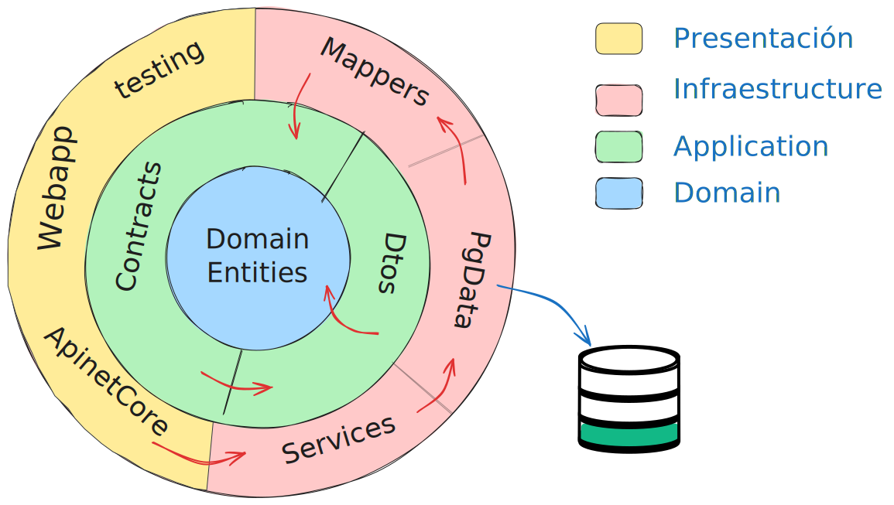

## [Capas Centrales Core](#contenido)

<details>
  <summary>
    Domain
  </summary>

   La capa de dominio es el núcleo de la arquitectura Onion y se encarga de modelar las reglas y la lógica de negocio fundamentales de la aplicación. Su independencia de las tecnologías externas asegura que la lógica de negocio no dependa de la infraestructura o la interfaz de usuario.

>*La capa está definida por un único proyecto, que incluye las entidades (POCOS) que deben ser organizadas dentro de un directorio denominado con el mismo nombre que el contexto de la base de datos. Por ejemplo, si el contexto de la base de datos se llama "SeguridadDb", el directorio debe llamarse "SeguridadDb".*

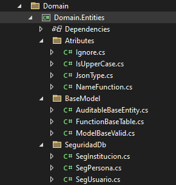

**Componentes Principales:**

- :+1: **Entidades**:

    Las entidades son objetos de negocio con una identidad única que representan conceptos clave del dominio, como "Cliente" o "Pedido", y están estrechamente relacionadas con la estructura de una base de datos. Incluyen propiedades y métodos que reflejan el comportamiento y las reglas del negocio, asegurando que los datos se mantengan consistentes y válidos. esta son registradas en un folder con nombre correspondiente al contexto de base de datos.

- :+1: **Atributes**:

    Definicion de los atributos personalizados para agregar metadatos y reglas a las propiedades de las entidades o entidades, proporcionando un medio estructurado para definir comportamientos y restricciones.

- :+1: **BaseModel**:

    Definicion de clases base para facilitar el modelado y la reutilización de componentes,  propiedades comunes que se comparten entre varias entidades. Estas propiedades se abstraen en clases base o interfaces, permitiendo que múltiples entidades hereden atributos y comportamientos comunes.

</details>

<details>
  <summary>Application</summary>

   La Capa de Aplicación actúa como intermediaria entre la capa de dominio y otras capas externas. En esta capa se registran los contratos o interfaces, que se utilizan para la inyección de dependencias.

>*La capa está definida por dos proyecto, Contracts(para definir las interfaces y contratos de negocio) y Dtos (par definir los modelos de datos de consulta)*

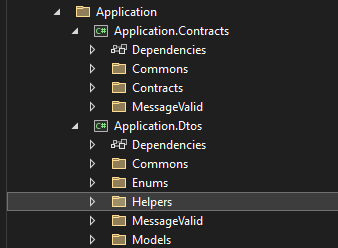

- :+1: **Contracts**  
        - Commons
        - Contracts
        - MessageValid

- :+1: **Dtos**
       - Commons
       - Enums
       - Helpers
       - MessaegValid
       - Models

</details>

## [External](#contenido)

<details >
<summary>Infraestructure</summary>

- Mappers
  - Implements
  - Interfaces
  - Profiles
  - Resources
  - Validators
- PgData
   Contexts
   FactoryRepo
   Helpers
   Logs

- Services
  - Implements

</details>

<details >
<summary>Presentation</summary>

- ApiNetCore
  - Authentication
  - Controllers
- Testing
- WebAppCore

</details>

## [Estandar de Desarrollo](#contenido)

<details>
<summary>Base de datos</summary>

- en construccion

</details>

## [Guia de Desarrollo](#contenido)

Esta guía de desarrollo tiene como objetivo proporcionar un marco paso a paso para establecer y desarrollar en un proyecto basado en la plantilla onion propuesta de manera efectiva. Siguiendo estos pasos, los integrantes del equipo de desarrollo pueden asegurar que todos los aspectos del proyecto estén correctamente configurados.

## [Pasos previos al desarrollo](#contenido)

### 1. Configurar Proyecto

**Objetivo:** Establecer la base del proyecto con las herramientas y dependencias necesarias.

**Pasos:**

- **Inicializar repositorio:** Mediante ***Git*** inicializa el repositorio loical en un directorio de la plantilla [solucionOnion](https://gitlab.com/cssprosrl1/soluciononion.git).

>***Nota:*** Se debe contar con los permisos de accesos al repositorio oficial, La plantilla **SolucionOnion** puede variar segun el contexto de trabajo que se acuerda o el proyecto en curso*

``` bash
  root@ecs-desarrollo:# mkdir repositorio
  root@ecs-desarrollo:# cd repositorio
  root@ecs-desarrollo:/repositorio# git clone https://gitlab.com/cssprosrl1/soluciononion.git
```

- **Estructura del proyecto:** La estructura de directorios del proyecto definido segun  vista en los puntos [Estructura de Arquitectura](#estructura-de-arquitectura) siguiendo las mejores prácticas.

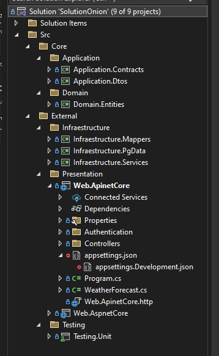

- **Dependencias:** Todas las dependencias del proyecto estan gestionadas por el gestor de paquetes [NuGet](https://learn.microsoft.com/es-es/nuget/what-is-nuget) de Microsoft, por lo tanto solo se requiere realizar una recompilacion del proyecto para obtenerlas.

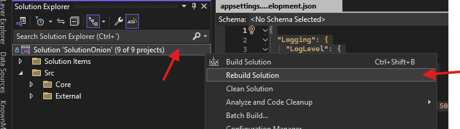

- **Configuración adicional**: Configuración adicional: Por motivos de seguridad, los archivos appsettings.Development.json y appsettings.json del proyecto de presentación no están incluidos en el control de versiones. Deberás crear estos archivos en la raíz del proyecto principal de presentación e incluir el siguiente contenido.

``` json
{
  "Logging": {
    "LogLevel": {
      "Default": "Information",
      "Microsoft.AspNetCore": "Warning"
    }
  },
  "ConnectionStrings": {
    "nombre_cadena_coneccion": "Host=IP_HOST_;Database=DB_NAME_;Username=USER_NAME_;Password=PASWWORD; Command Timeout=0;ApplicationName={0}"
  },
  "AssemblyConfig": {
    "InterfaceAssembly": "Application.Contracts",
    "InterfaceNamespace": "Application.Contracts.Contracts",
    "ImplementationAssembly": "Infraestructure.Services",
    "ImplementationNamespace": "Infraestructure.Services.Implements"
  },
  "JwtOptions": {
    "Key": "LLAVE_SECRETEA_GENERADOR_TOKEN_32BITS_",
    "Issuer": "http://localhost:5112",
    "Audence": "http://localhost:5112"
  },
  "SettingsApp": {
    "UrlImagen": "C:\\inetpub\\wwwroot\\Galeria\\SEG_SISTEMAS\\",
    "CPassDefault": "1825"
  },
  "Cors": "http://localhost:5168,http://localhost:5000,http://localhost:5001"
}
```

>*Estos archivos registran las variables globales que el proyecto utilizará en sus configuraciones.*
>>*El archivo **appsettings.Development.json** se utilizará cuando la aplicación esté en modo desarrollo o se compile en modo **Debug**, mientras que el archivo **appsettings.json** se empleará en compilaciones tipo **Release** o durante la publicación de la aplicación. El contenido de estos archivos estan definidos en el anterior punto*

### 2. Configurar Contexto de Conexción

**Objetivo:**

Configurar los contextos de conexción a la base de datos para que la aplicación interactúe con servicios externos, WebAPIs, WebApp, etc.

**Pasos:**

- **Archivos de configuración:** Los archivos de configuración para el proyecto de presentación WebApi son appsettings.json para el entorno de producción y appsettings.Development.json para el entorno de desarrollo descritas en el anterior punto [Configuración adicional](#L180), especificamente se debe configurar la seccion ***ConnectionStrings***

``` json
.......,
  "ConnectionStrings": {
    "nombre_cadena_coneccion": "Host=IP_HOST_;Database=DB_NAME_;Username=USER_NAME_;Password=PASWWORD; Command Timeout=0;ApplicationName={0}"
  },
  ......
````

>*Para facilitar el mantenimiento y mejorar la legibilidad, se recomienda nombrar la cadena de conexión con el sufijo Db. Por ejemplo, use SeguridadDb, donde "Seguridad" es un nombre corto en formato [PascalCase](https://www.aluracursos.com/blog/convenciones-de-nomenclatura-camel-pascal-kebab-snake-case)*

- **Definicion de Clase Contexto de Conexcion :** Situarse en el proyecto "Infraestructure.PgData" situada en ***~External/Infraestructure/Infraestructure.PgData***
, dentro la carpeta ***Contexts*** crear una clase con el nombre de la cadena de conexion añadiendo el sufijo Context, este debe herdar de la clase abstracta **BaseContext**
como se oberva en el siguiente ejemplo:

Ejemplo:

```csharp
 public class $nombre_cadena_conexcion$Context : BaseContext
{
    public $nombre_cadena_conexcion$Context(DbContextOptions<$nombre_cadena_conexcion$Context> options) : base(options)
    {
        AppContext.SetSwitch("Npgsql.EnableLegacyTimestampBehavior", true);
    }


    protected override void OnModelCreating(ModelBuilder modelBuilder)
    {
        HelpersBuilders.ScanToRegisterDbSet(modelBuilder, nameof($nombre_cadena_conexcion$Context));
    }
} 

```

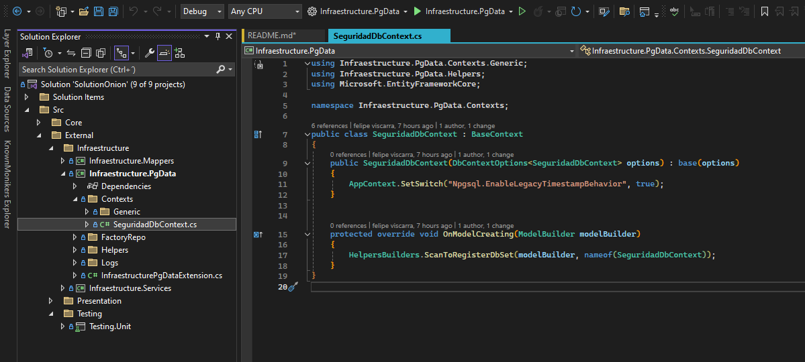

- **Registrar servicio de FactoryContextPoll:** En la raiz del proyecto ***Infraestructure.PgData*** abrir la clase ***InfraestructurePgDataExtension.cs*** y agregar las siguientes lineas y reemplazar ***"nombre_cadena_conexcion"***:

``` cs
 services.AddPooledDbContextFactory<SeguridadDbContext>(options =>
                                        options.UseNpgsql(configuration.GetConnectionString("nombre_cadena_conexcion") ??
                                        throw new InvalidOperationException("No existe conexcion con el servidor de base de datos"))
                                        .UseSnakeCaseNamingConvention());

```

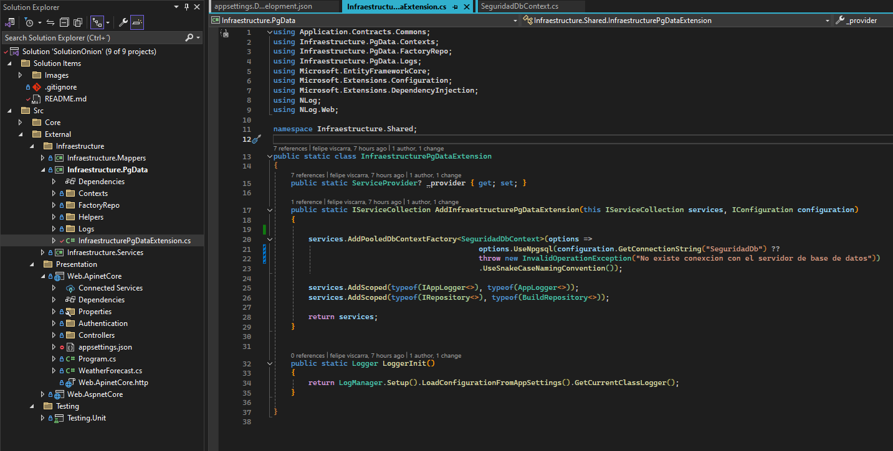

## [Pasos en el Desarrollo](#contenido)

### 1. Definir Entidades

La arquitectura propuesta utiliza el ORM Entity Framework Core 8.0, lo que permite que la definición de entidades sea un proceso flexible y adaptable a diversas necesidades. A continuación, se presentan las principales opciones y métodos para definir entidades dentro de esta arquitectura.

Las entidades deben ser definidas en el proyecto **Domain.Entitys** de la capa central ***Core*** dentro el directorio definido con el nombre del contexto de conexcion definida anteriormente.

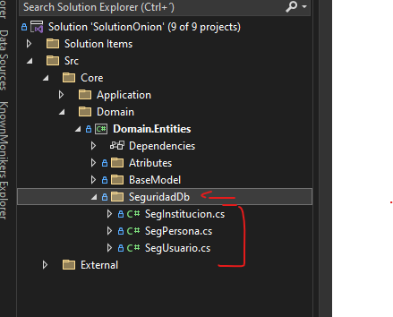

**Pasos:**

1. **Crear Clase Entidad:**

    Define una clase que represente las tablas de la base de datos, nombrando la clase en formato PascalCase. Hereda de la clase base abstracta ***AuditableBaseEntity*** (clase con propiedades comunes de auditoria) y utiliza la anotación de datos **[Table]** con las propiedades ***name*** y ***schema***, especificando el nombre de la tabla y su esquema correspondiente en la base de datos.

    >*La arquitectura define los nombres de las tablas y entidades utilizando el formato SnakeCase, que separa cada palabra con un guion bajo ("_"). Luego, estos nombres se convierten automáticamente a PascalCase cuando se traducen al ORM*

    Ejemplo:

    ```cs

    [Table("nombre_entiad", Schema = "public")]
    public class NombreEntidad : AuditableBaseEntity
    {
  
    }

    ```

2. **Propiedades/Anotaciones**

    Cada propiedad representa a un campo de la tabla de la base de datos, la misma especifica el tipo de dato mapeado segun la momenglagrua de EntityFramework Core 8, para identificar el la propiedad de llave primaria se debe agregar la anotación ***[Key]*** y el nombre de esta propiedad debe ser el nombre de la entidad agregando el prefijo **Id**.

    ```cs
    [Table("nombre_entiad", Schema = "public")]
    public class NombreEntidad : AuditableBaseEntity
    { 
      [Key]
      public int IdnombreEntidad {get; set;}
    }
    ```

    >*De forma obligatoria en toda entidad se debe definir al menos una propiedad como llave primaria identificada con el decorado [Key]*

    - **Consideraciones adicionales**:

      **(Opcional) Definicion de propiedades de Navegacion**:

      Las propiedades de navegación son propiedades de una clase de entidad que representan una relación con otra entidad. Pueden ser de los siguientes tipos:

      - Referencia (uno a uno o muchos a uno): Cuando una entidad tiene una relación de referencia a otra entidad.
      - Colección (uno a muchos o muchos a muchos): Cuando una entidad tiene una relación de colección con otras entidades.

      **Pasos para Definir Propiedades de Navegación**
        1. Definir las Clases de Entidad

            Primero, define las entidades involucradas en la relación. Asegúrate de incluir propiedades que representen las claves foráneas si es necesario.

            Ejemplo de Relaciones Uno a Muchos

            ```cs
              public class Cliente
              {
                  public int ClienteId { get; set; } // Clave primaria
                  public string Nombre { get; set; }

                  // Propiedad de navegación a una colección de Pedidos
                  public ICollection<Pedido> Pedidos { get; set; }
              }

              public class Pedido
              {
                  public int PedidoId { get; set; } // Clave primaria
                  public DateTime Fecha { get; set; }
                  
                  // Clave foránea
                  public int ClienteId { get; set; }
                  
                  // Propiedad de navegación a Cliente
                  public Cliente Cliente { get; set; }
              }
            ```

            En el ejemplo anterior, un Cliente puede tener múltiples Pedidos, y cada Pedido está asociado con un único Cliente.

            Ejemplo de Relaciones Uno a Uno

            ```cs
              public class Cliente
              {
                  public int ClienteId { get; set; }
                  public string Nombre { get; set; }

                  // Propiedad de navegación a DetalleCliente
                  public DetalleCliente Detalle { get; set; }
              }

              public class DetalleCliente
              {
                  public int DetalleClienteId { get; set; }
                  public string Direccion { get; set; }

                  // Clave foránea y propiedad de navegación
                  public int ClienteId { get; set; }
                  public Cliente Cliente { get; set; }
              }
                              
            ```

            Aquí, un Cliente tiene un único DetalleCliente, y DetalleCliente está asociado con un único Cliente.

            Ejemplo de Relaciones Muchos a Muchos

            En EF Core 5 y versiones posteriores, incluyendo EF Core 8, puedes establecer relaciones muchos a muchos sin una entidad de unión explícita:

            ```cs
            public class Estudiante
            {
                public int EstudianteId { get; set; }
                public string Nombre { get; set; }

                // Propiedad de navegación a Cursos
                public ICollection<Curso> Cursos { get; set; }
            }

            public class Curso
            {
                public int CursoId { get; set; }
                public string Titulo { get; set; }

                // Propiedad de navegación a Estudiantes
                public ICollection<Estudiante> Estudiantes { get; set; }
            }
            ```

        2. Configurar el Modelo de Datos con Fluent API

            Aunque EF Core intenta configurar las relaciones automáticamente a través de convenciones, es una buena práctica definirlas explícitamente usando Fluent API para asegurar que el mapeo se realice de la manera que deseas.

            Configuración de Relaciones Uno a Muchos

            ```csharp
            protected override void OnModelCreating(ModelBuilder modelBuilder)
            {
                modelBuilder.Entity<Cliente>()
                    .HasMany(c => c.Pedidos)
                    .WithOne(p => p.Cliente)
                    .HasForeignKey(p => p.ClienteId);
            }
            ```

            Configuración de Relaciones Uno a Uno

            ```csharp
              protected override void OnModelCreating(ModelBuilder modelBuilder)
              {
                  modelBuilder.Entity<Cliente>()
                      .HasOne(c => c.Detalle)
                      .WithOne(d => d.Cliente)
                      .HasForeignKey<DetalleCliente>(d => d.ClienteId);
              }
            ```

            Muchos a Muchos

            ```csharp
              protected override void OnModelCreating(ModelBuilder modelBuilder)
              {
                  modelBuilder.Entity<Estudiante>()
                      .HasMany(e => e.Cursos)
                      .WithMany(c => c.Estudiantes)
                      .UsingEntity(j => j.ToTable("EstudianteCurso"));
              }
            ```

### 2. Definir DTOs

Los DTOs son objetos que se utilizan para transferir datos entre procesos. En el contexto de Entity Framework, se usan para transportar datos desde la base de datos hasta la capa de presentación sin exponer directamente las entidades del modelo de datos.

Las clases Dto's deben ser definidas en el proyecto ***Application.Dtos*** de la capa central **Core/Application** dentro el directorio ***Models*** y dentro el directorio especifico del contexto de desarrollo.


**Pasos:**

- **Crear DTOs:**

    Crea clase DTO que representen los datos que deseas transferir. Estos deben ser simples, sin lógica de negocio, y contener solo las propiedades necesarias.

    >*Opcionalmente, puedes agregar anotaciones para identificar restricciones de negocio, asegurando que los datos cumplan con reglas específicas antes de ser procesados o almacenados. Algunos ejemplos comunes incluyen: [Required], [StringLength], [Range], [MaxLength] ext.*

    Ejemplo:

    ```cs

      public class SegModuloDto
      {
          [Required(ErrorMessage = "Id Modulo es requerido")]
          public int IdsegModulo { get; set; }
          public int? Posicion { get; set; }
          [MaxLength(150)]
          public string? Icono { get; set; }
          [MaxLength(150)]
          public string? Modulo { get; set; }
      }

    ```

    ```cs
    
        public record class RegisterPersonaDto(int? IdsegPersona = null, 
                                              string? Nombre = null, 
                                              string? ApPaterno = null,
                                               string? ApMaterno = null,
                                                string? Cedula = null, 
                                                string? Complemento = null, int? 
                                                IdcExpedido = null)
        {

            public int? IdsegPersona { get; set; } = IdsegPersona;
            public string? Nombre { get; set; } = Nombre;
            public string? ApPaterno { get; set; } = ApPaterno;
            public string? ApMaterno { get; set; } = ApMaterno;
            public string? Cedula { get; set; } = Cedula;
            public string? Complemento { get; set; } = Complemento;
            public int? IdcExpedido { get; set; } = IdcExpedido;
        }

  ```

  ```cs
      
          public record class SessionCokie
          {
              public string? Login { get; set; }
              public string? KeyAccess { get; set; }

          }

  ```
  
### 3. Registro de Profiles

La arquitectura utiliza principalmente la biblioteca de mapeo ***AutoMapper***, la cual requiere registrar una clase de ***Profile*** encargada de definir la relación entre los DTO y las entidades.

Las clases Profile deben ser definidas en el proyecto ***Infraestructure.Mappers*** de la capa ***Eternal/Infraestructure*** dentro el directorio ***Profiles*** y dentro el directorio especifico del contexto de desarrollo.

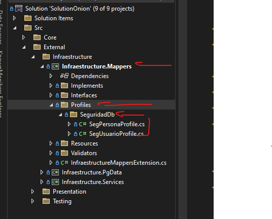

  **Pasos:**

  1. **Creación de Clases Profies:**
  
      Dentro el directorio **Profiles** y el directorio contexto de desarrollo, crea una clase nueva con el nombre de la entidad añadiendo el sufijo **Profile**, la clase debe heredar de la clase abastracta Profile.

      ```cs
      public class SegPersonaProfile : Profile
      {

      }

      ```

      Definir el constructor de la clase y escribir el perfil de mapeo

      ```cs
        public class SegPersonaProfile : Profile
        {
          public SegPersonaProfile()
          {
              CreateMap<SegPersona, RegisterPersonaDto>().ReverseMap();              
          }
        }

      ```

      (Opcional) Definir las proyeciones de consulta **Projection** La definición de CreateProjection en AutoMapper es una característica útil que permite configurar proyecciones directas desde una entidad a un DTO sin necesidad de cargar toda la entidad en la memoria. A diferencia de CreateMap, que se utiliza para el mapeo general entre dos tipos de objetos, CreateProjection está diseñado específicamente para transformar consultas LINQ en proyecciones SQL eficientes.

      ```cs
        public class SegPersonaProfile : Profile
        {
          public SegPersonaProfile()
          {
              CreateMap<SegPersona, RegisterPersonaDto>().ReverseMap();
              CreateProjection<SegPersona, RegisterPersonaDto>();          
          }
        }

      ```

### 4. Definir Interfaces o Contratos

**Objetivo:** Definir contratos para la interacción entre diferentes partes del sistema. las interfaces en una arquitectura Onion son esenciales para asegurar la independencia de las capas, mejorar la mantenibilidad del sistema, facilitar el testeo, y permitir flexibilidad en las implementaciones. Esto resulta en un sistema más robusto, adaptable y fácil de mantener.

Las interfaces o contratos deben ser definidas en el proyecto ***Application.Contracts*** de la capa ***Core/Application*** dentro el directorio ***Contracts*** y dentro el directorio especifico del contexto de desarrollo.

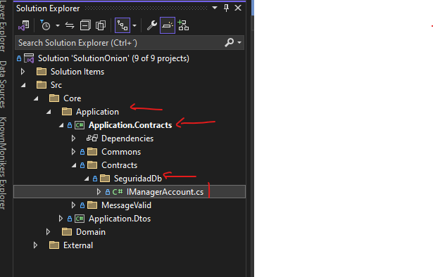

**Pasos:**

1. **Crear interface:**
  Dentro el directorio descrito anteriormente cree una nueva clase de tipo Interface, el nombre debe cumplir el formato PascalCase y con el frefijo **" I "**

    Ejemplo:

    ```cs
      public interface IManagerAccount
      {
        
      }
    ```

2. **Registrar metodos requeridos**

    Definir qué acciones o métodos están disponibles para interactuar con un componente sin exponer su implementación interna. Esto permite que las capas superiores trabajen con abstracciones y no con detalles de implementación.

    Ejemplo:

    ```cs
      public interface IManagerAccount
      {
        Task<ResponseAction> Login(string? username, string? password);

        Task<ResponseAction> IsValidToken(string vToken);        
      }
    ```

    >***NOTA:-** Por estandar todos los metodos deberan devolver un objeto generico de tipo **ResponseAction*** el mismo contendra las propiedades necesarias para las respuestas de las acciones.

### 5. Definir Implementaciones

Las implementaciones concretas de las interfaces definidas en la capa de aplicación, Aquí es donde se concreta la lógica para interactuar con servicios externos.

**Pasos:**

1. **Crear Clase de Implementacion:** 

    Esta clase debe exponer los metodos de la interfaz y debe tener el nombre de la interfaz de la que hereda sin el prefijo **" I "**

    Las clases de implementación deben ser definidas en el proyecto ***Infraestructure.Services*** de la capa ***Eternal/Infraestructure*** dentro el directorio ***Implements*** y dentro el directorio especifico del contexto de desarrollo.

    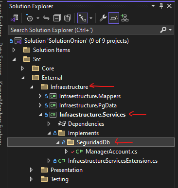

    Ejemplo de clase implementaición:

    ```cs

      public class ManagerAccount : IManagerAccount
      {

          public Task<ResponseAction> IsValidToken(string vToken)
          {
              throw new NotImplementedException();
          }

          public Task<ResponseAction> Login(string? username, string? password)
          {
              throw new NotImplementedException();
          }

      }

    ```

2. **Agregar o heredar implementaciones genéricas:**

    Se deben heredar las implementaciones de la clase abstracta ***BaseService\<TClass>***, donde ***TClass*** representa la clase concreta que está implementando la herencia.

    Ejemplo:

    ```cs

      public class ManagerAccount : BaseService<ManagerAccount>, IManagerAccount
      {

          public Task<ResponseAction> IsValidToken(string vToken)
          {
              throw new NotImplementedException();
          }

          public Task<ResponseAction> Login(string? username, string? password)
          {
              throw new NotImplementedException();
          }
      }

    ```
  
    La clase abstracta ***BaseService\<TClass>*** permite mantener un constructor mas limpio de la implementacion heredando los siguientes métodos genericos:

    - ***_Valid***: Servicios para la ejecucion de las reglas de validacion definidas por el desarrollador.
    - ***_Mapper***: Servicios para la ejecucion de mapeos definidios en los perfiles de mapeo por el desarrollador.
    - ***_Logger***: Servicios de registro de logs durante la ejecucion.
    - **_StateContext**: Objeto contenedor del estado de session de la aplicacion
    - ***_jwtOption***: Configuraciones globales utilizadas en la generacion de jwtokens
    - ***_setting***: Configuraciones glogales del sistema especificadas en el archivo appsettings.json.

3. **Inyectar Repositorio Genérico:**

   El constructor de la clase debe inyectar el repositorio genérico ***IRepository\<TContextDb>***, donde TContextDb representa el contexto de conexión que se utilizará.

    Ejemplo :

    ```cs
    
        protected readonly IRepository<SeguridadDbContext> repo;

        public ManagerAccount(IRepository<SeguridadDbContext> _repo) : base()
        {
            repo = _repo;
        }

    ```

4. ***Estructura basica de un método:***

    Por estandar un metodo o funcion debera respetar el siguiete cuerpo:

    >****NOTA:-*** Para ejecutar las consultas de a la base de datos debe hacer uso de la funcion ***DbFactory*** y el metodo ***CreateDbContextAsync*** el mismo se encargara de inicializar una instancia de conexcion a la base de datos*

    ```cs
          {
            ///inicializacion de variables correspondientes al metodo
            ResponseAction vResult;
            try
            {
                //ejecucion de metodos y/o procesos correspodientes a la logica de negocio
                // no necesita una conexcion con la base de datos

                using (repo._dbContext = await repo!.DbFactory().CreateDbContextAsync())
                {
                  /// ejecucion de metodo y/o proceos correspondientes a la logica de negocio
                  /// que necesitan una conexcion a la base de datos.
                }

            }
            catch (Exception e)
            {
              // tratamiento de excepciones en el codigo 
                vResult = new ResponseAction(State.Error, _Logger!.Register(e));
            }

            return vResult;
          }
    ```

    >*Al utilizar Entity Framework como ORM, se puede aprovechar otros métodos disponibles en este framework, como Where, Get, o incluso utilizar expresiones LinQ*

    1. **Obtener Un Registro**:

    Para realizar la consulta de un registro especifico mediante el objeto repositorio inyectador anteriormente ***IRepository\<TContextDb>*** mediante el metodo FindAsync enviando como parametro el id del registro.

    Ejemplo:

    ```cs

    var _User = await repo.Entity<SegUsuario>().FindAsync(pIdsgUsuario);

    ```

    Ejemplo con Where Lambda

    ```cs
    
    var User = repo.Get<SegUsuario>().Where(x => x.IdsegUsuario == pIdsgUsuario).FirstOrDefaultAsync();

    ```

    Ejemplo con expresiones LinQ

    ```cs
    
    var user = await (from u in repo.Entity<SegUsuario>()
                      where u.IdsegUsuario == pIdsegUsuario
                      select u).FirstOrDefaultAsync();

    ```

  **Pasos:**

  - **Definición de reglas:** Define las reglas de validación necesarias para cada entidad y DTO.
  - **Implementación de validadores:** Crea validadores que apliquen estas reglas.
  - **Pruebas de validación:** Escribe pruebas para verificar que las validaciones se realizan correctamente.

  ### 7. Crear Controlador de Servicios

  **Objetivo:** Exponer los servicios de la aplicación a través de un controlador API.

  **Pasos:**

  - **Definición de rutas:** Define las rutas y endpoints necesarios para el controlador.
  - **Implementación de lógica:** Usa los servicios para implementar la lógica en los controladores.
  - **Manejo de errores:** Asegúrate de que los controladores manejan errores y excepciones adecuadamente.

  ### 8. Pruebas de Servicios API

  **Objetivo:** Asegurar que los servicios API funcionan según lo esperado.

  **Pasos:**

  - **Pruebas unitarias:** Escribe pruebas unitarias para los controladores.
  - **Pruebas de integración:** Implementa pruebas de integración para verificar el flujo completo de datos.
  - **Pruebas de carga:** Realiza pruebas de carga para asegurar que la API puede manejar el tráfico esperado.
